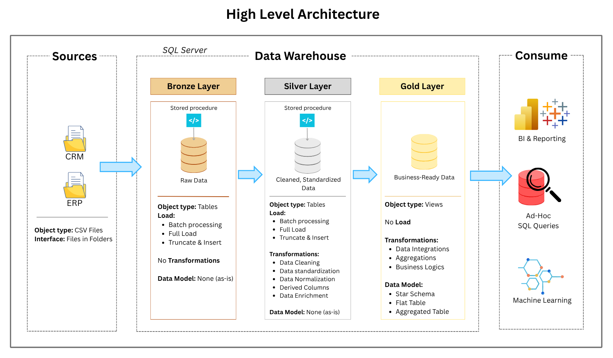
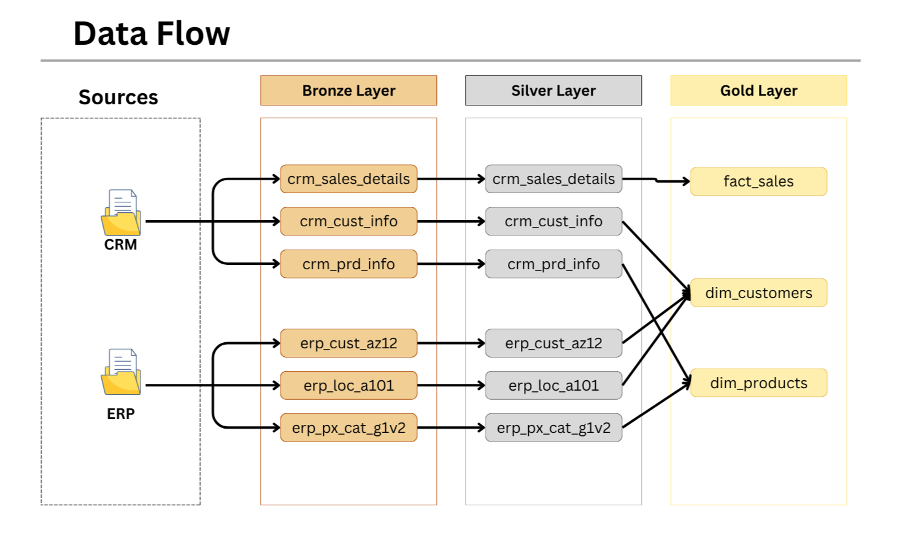
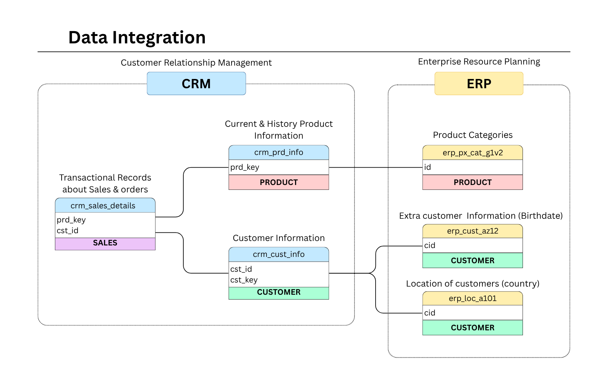
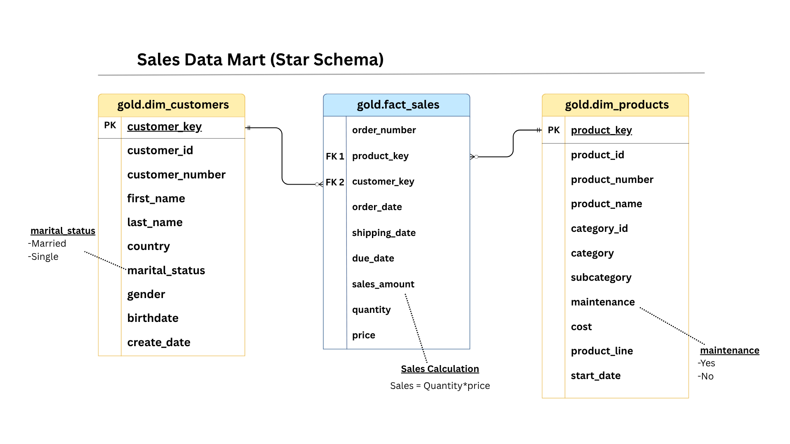

# Data Warehouse and Analytics

This project implements a **Modern Data Warehouse** using SQL Server to consolidate sales data, enabling analytical reporting and informed decision-making.

## 📖 Project Overview
This project involves:

1. **Data Architecture**: Designing a Modern Data Warehouse Using Medallion Architecture **Bronze**, **Silver**, and **Gold** layers.
2. **ETL Pipelines**: Extracting, transforming, and loading data from source systems into the warehouse.
3. **Data Modeling**: Developing fact and dimension tables optimized for analytical queries.

## 🛠️ Data Processing Specifications
- **Data Sources**: Import data from two source systems (ERP and CRM) provided as CSV files.
- **Data Quality**: Cleanse and resolve data quality issues prior to analysis.
- **Integration**: Combine both sources into a single, user-friendly data model designed for analytical queries.
- **Scope**: Focus on the latest dataset only; historization of data is not required.
- **Documentation**: Provide clear documentation of the data model to support both business stakeholders and analytics teams.

## 🧩 Data Sources

The warehouse integrates two main data sources:

* **CRM Data** (`source_crm/`) – Customer profiles, interactions, campaigns.
* **ERP Data** (`source_erp/`) – Sales orders, invoices, products, financial data.

These sources are provided in CSV format and ingested into the Bronze layer.

## 🧱 Data Architecture

The data architecture for this project follows Medallion Architecture **Bronze**, **Silver**, and **Gold** layers :



1. **Bronze Layer**: Stores raw data as-is from the source systems. Data is ingested from CSV Files into SQL Server Database.
2. **Silver Layer**: This layer includes data cleansing, standardization, and normalization processes to prepare data for analysis.
3. **Gold Layer**: Houses business-ready data modeled into a star schema required for reporting and analytics.

## ➡️ Data Flow



Data flows from CRM and ERP systems into the **Bronze Layer**, gets refined in the **Silver Layer**, and is finally modeled into dimensional tables in the **Gold Layer**.


## 🔗 Data Integration



Data from CRM and ERP systems is joined using common keys (e.g., `customer_id`, `product_key`).

* `crm_sales_details` joins with product and customer information.
* `erp_cust_az12`, `erp_loc_a101` enrich CRM data with additional dimensions.
* Product details from both systems are merged via `prd_key` or `id`.


## 📊 Data Model (Star Schema)



The **Gold Layer** implements a Star Schema for efficient querying.

### Tables:
* Fact table: `gold.fact_sales`
* Dimension tables: `gold.dim_customers` and `gold.dim_products`


## 🧪 Data Quality Checks

Implemented in `tests/` folder:

* **Silver**: Null checks, type consistency
* **Gold**: Referential integrity, duplicates, business rules


## 📘 Documentation

* 📚 `data_catalog.md`: Field-level metadata for all tables
* 🧾 `naming_conventions.md`: SQL & object naming best practices
* 🖼 Diagrams:

  * Data Architecture → `data_architechture.png`
  * Data Flow → `data_flow.png`
  * Data Integration → `data_integration.png`
  * Star Schema Model → `data_model.png`

## ✨ Highlights

* ✅ **Layered Architecture**: Ensures separation of raw, refined, and analytical data
* ✅ **Data Integration**: Combines structured CRM & ERP data
* ✅ **Star Schema**: Optimized for BI tools
* ✅ **Validation Suite**: Prevents bad data from entering analytics


## 📂 Repository Structure
```
sql-data-warehouse/
│
├── datasets/                           # Raw datasets used for the project (ERP and CRM data)
│
├── docs/                               # Project documentation and architecture details
│   ├── data_architecture.png           
│   ├── data_catalog.md                 # Catalog of datasets, including field descriptions and metadata
│   ├── data_flow.png                   
│   ├── data_model.png                  
│   ├── data_integration.png            
│   ├── naming-conventions.md           # Consistent naming guidelines for tables, columns, and files
│
├── scripts/                            # SQL scripts for ETL and transformations
│   ├── bronze/                         # Scripts for extracting and loading raw data
│   ├── silver/                         # Scripts for cleaning and transforming data
│   ├── gold/                           # Scripts for creating analytical models
│
├── tests/                              # Test scripts and quality files
│                     
└── README.md                           # Project overview 
``` 
---


## 🧰 Tech Stack

| Tool           | Purpose                          |
|----------------|----------------------------------|
| SQL Server     | Database & Data Warehouse        |
| SQL (T-SQL)    | ETL & Transformation Logic       |               


## 🔮 Future Improvements

* Integrate with Apache Airflow/dbt for automated ETL orchestration
* Incremental & Real-time Data Loading
* Connect to a BI tool like Tableau for reporting
